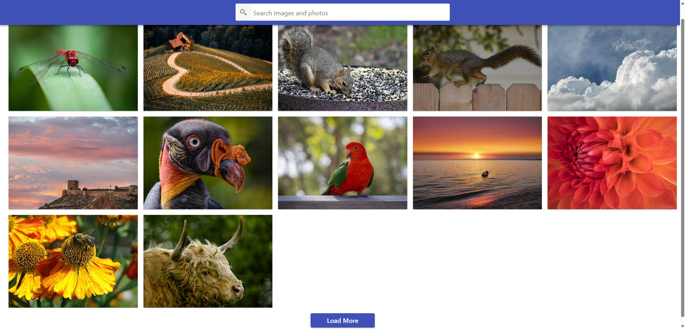

# Images

https://viache-slav.github.io/goit-react-hw-04-images/ - link to the working page in github

This project was created as a react.js homework assignment from GOIT school

This project is an application for searching images by keywords.

To run the project on your hardware: 
   - you need to clone this repository https://github.com/Viache-Slav/goit-react-hw-04-images.git
   - мusisz dodać swój unikalny klucz api
   - run the installation with the command `npm install`
   - start the project with the command `npm start`

## screenshot
